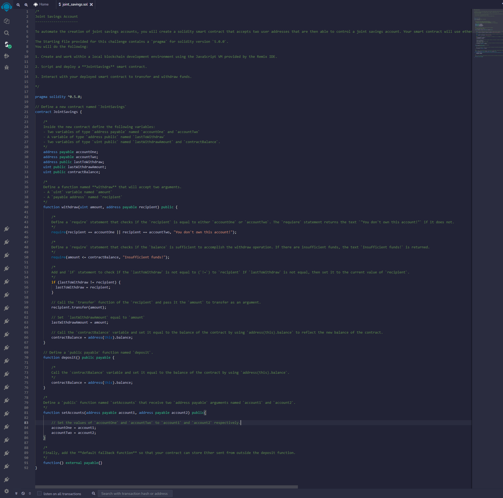
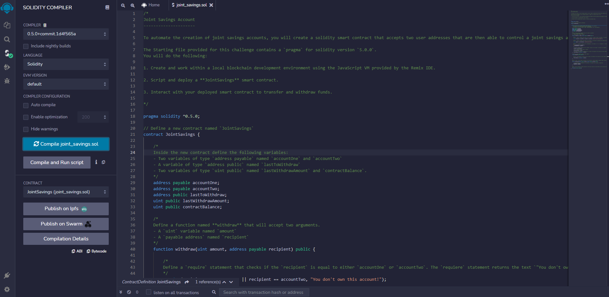
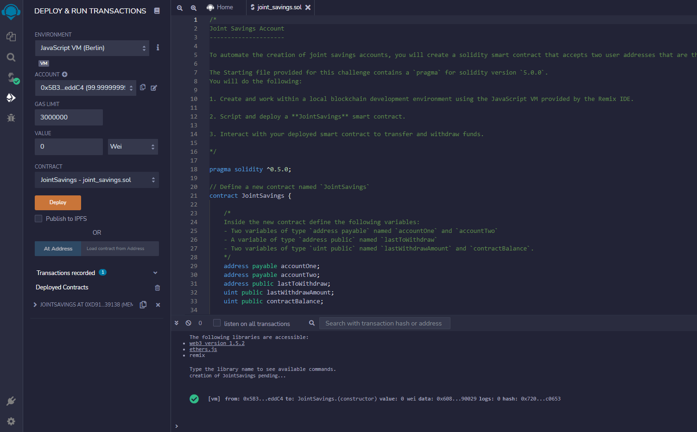
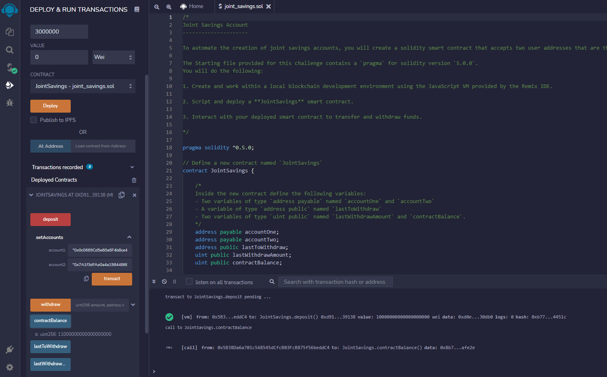
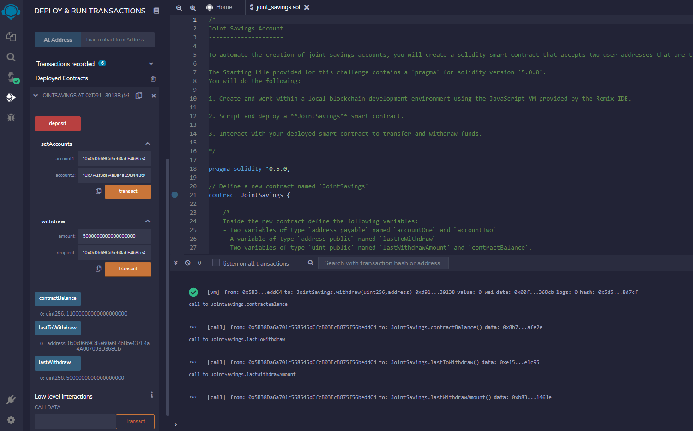
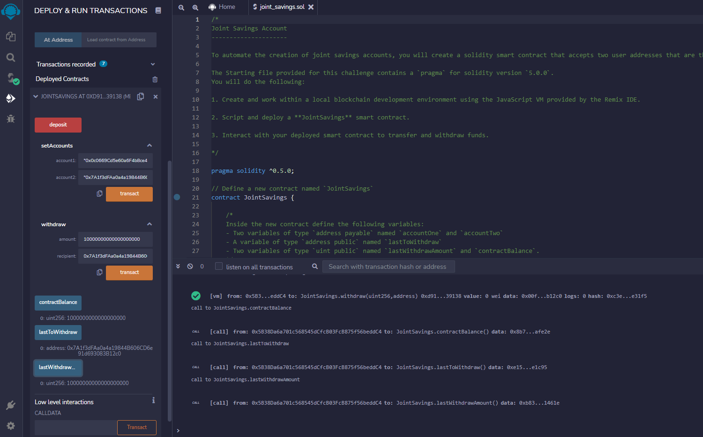

# Joint Savings Account

### Background

A Solidity smart contract that accepts two user addresses to automate the setup of joint savings accounts. A joint savings account will be accessible to these addresses. The smart contract will implement a financial institution's needs for delivering shared savings account features using ether management functions including the ability to deposit and withdraw money from the account.

---

### Steps completed

1. Create a joint savings account contract in solidity

*Solidity Contract*

2. Compile and deploy the contract in the JavaScript VM

*Compile*

*Deploy*

3. Interact with the deployed smart contract

*Send 1 ether as wei*

*Send 10 ether as wei*

*Send 5 ether*

*Withdraw 5 ether into accountOne*

*Withdraw 10 ether into accountTwo*

---
